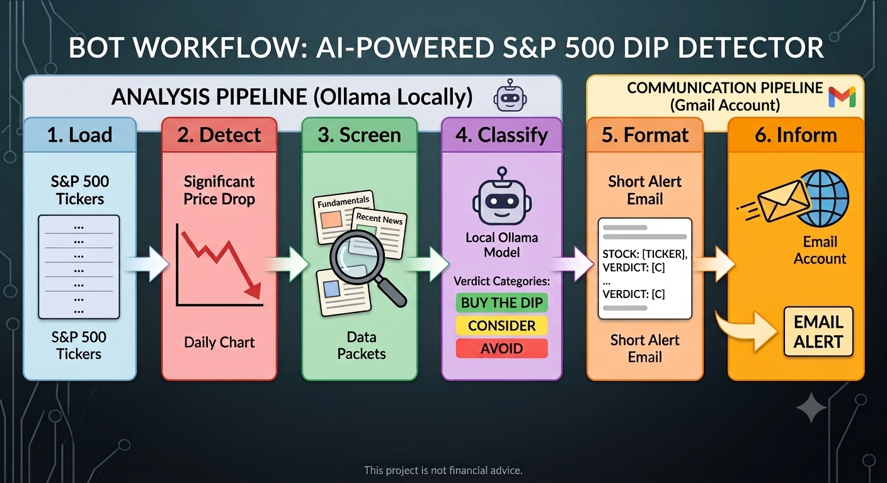

<a id="readme-top"></a>

<h3 align="center">Stock Market Dip Alert Bot</h3>

<p align="center">
  S&P 500 dip screening and AI email alerts using Ollama.
</p>

<p align="center">
  
</p>

<!-- TABLE OF CONTENTS -->

<details>
  <summary>Contents</summary>
  <ol>
    <li><a href="#about-the-project">About the Project</a></li>
    <li><a href="#requirements">Requirements</a></li>
    <li><a href="#usage">Usage</a></li>
    <li><a href="#workflow">Workflow</a></li>
    <li><a href="#notes">Notes</a></li>
    <li><a href="#contact">Contact</a></li>
  </ol>
</details>

<!-- ABOUT THE PROJECT -->

## About the Project

This bot monitors S&P 500 stocks for sharp price declines and uses a local Ollama model to assess whether a stock may be worth considering as a dip-buying opportunity.

The final result is sent as a short email alert.

### Workflow

```text
┌─────────┐
│   LOAD  │
└────┬────┘
     │ S&P 500 stock list
     ▼
┌─────────┐
│ DETECT  │
└────┬────┘
     │ Sharp price drops
     ▼
┌─────────┐
│ SCREEN  │
└────┬────┘
     │ Fundamentals + news
     ▼
┌───────────┐
│ CLASSIFY  │
└─────┬─────┘
      │ Ollama
      │ BUY / CONSIDER / AVOID
      ▼
┌─────────┐
│  FORMAT │
└────┬────┘
     │ Short alert
     ▼
┌─────────┐
│  INFORM │
└────┬────┘
     │
     ▼
   EMAIL
```

### What It Does

* Loads the S&P 500 ticker list.
* Detects stocks with sharp declines.
* Collects fundamentals and recent news.
* Sends the data to Ollama for analysis.
* Produces a `BUY`, `CONSIDER`, or `AVOID` verdict.
* Sends the result by email.

<p align="left">(<a href="#readme-top">back to top</a>)</p>

<!-- REQUIREMENTS -->

## Requirements

You need:

* Python
* `yfinance`
* `pandas`
* Ollama
* `gemma3:4b`
* Email account for sending alerts

Install dependencies:

```bash
pip install yfinance pandas
```

Make sure Ollama is running locally and `gemma3:4b` is available.

<p align="left">(<a href="#readme-top">back to top</a>)</p>

<!-- USAGE -->

## Usage

Configure the email and folder settings in:

```text
old_config.py
```

Run the bot:

```bash
python ollama_api.py
```

The bot will:

1. Load the S&P 500 stocks.
2. Find significant price declines.
3. Analyze fundamentals and news.
4. Ask Ollama for a verdict.
5. Format the result.
6. Send the email alert.

<p align="left">(<a href="#readme-top">back to top</a>)</p>

<!-- WORKFLOW -->

## Workflow

The application follows the  pipeline:

```text
Load → Detect → Screen → Classify → Format → Inform
```

The output is a compact email containing the stock, price movement, verdict, reasoning, risk level, and chart information.

<p align="left">(<a href="#readme-top">back to top</a>)</p>

<!-- NOTES -->

## Notes

This project is intended for stock screening and decision support.

**It is not financial advice.**

<p align="left">(<a href="#readme-top">back to top</a>)</p>

<!-- CONTACT -->

## Contact

For questions or issues, open a GitHub Issue in this repository.
